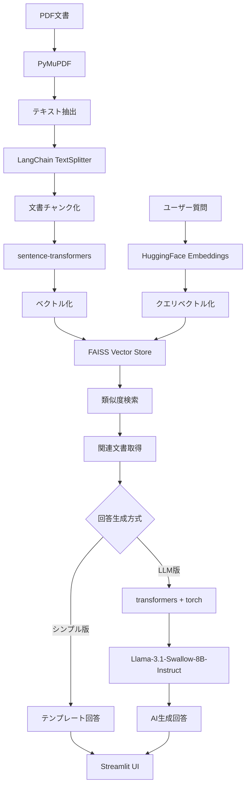

# RAG ChatBot Demo


RAG（Retrieval-Augmented Generation）を使用したチャットボットとして、福山市の公式PDF資料を活用したデモを作成しました。収集した福山市の公式文書から関連情報を検索し、質問に対してPDF資料から関連情報を検索して回答を生成する仕組みです。

## 🌟 主な機能

- **📄 文書検索**: 福山市の公式PDF資料から関連情報をセマンティック検索
- **💬 質疑応答**: 自然言語による質問に対する回答生成
- **📚 参考資料表示**: 回答の根拠となる資料の明示
- **📝 チャット履歴**: 過去の質問と回答の履歴管理
- **🎨 直感的UI**: Streamlitによる使いやすいWebインターフェース

## 🛠️ 技術仕様

### 使用技術
- **フロントエンド**: Streamlit
- **ベクトルデータベース**: FAISS
- **埋め込みモデル**: sentence-transformers/all-MiniLM-L6-v2
- **PDF処理**: PyMuPDF (fitz)
- **テキスト分割**: LangChain RecursiveCharacterTextSplitter
 - **LLMモデル**: tokyotech-llm/Llama-3.1-Swallow-8B-Instruct-v0.1（オプション）

### 📚 ライブラリの役割と技術選定理由

#### 🔍 LangChain エコシステム
```python
from langchain_community.vectorstores import FAISS
from langchain_huggingface import HuggingFaceEmbeddings
```

| ライブラリ | 役割 | 選定理由 |
|-----------|------|----------|
| **langchain-community** | ベクトルストア管理 | FAISSとの統合、ドキュメント検索の簡素化 |
| **langchain-huggingface** | 埋め込みモデル統合 | HuggingFaceモデルとLangChainの橋渡し |

**実装方式**: ハイブリッドアプローチ
- **検索フェーズ**: LangChain（文書検索・ベクトル化）
- **生成フェーズ**: 直接transformers（日本語LLM最適化）

#### 🤖 AI・機械学習ライブラリ
| ライブラリ | 役割 | 技術的特徴 |
|-----------|------|-----------|
| **transformers** | LLM推論エンジン | HuggingFace標準、モデル読み込み・推論 |
| **torch** | 深層学習フレームワーク | GPU加速、テンソル演算 |
| **sentence-transformers** | 埋め込み生成 | セマンティック検索用ベクトル化 |
| **bitsandbytes** | モデル量子化 | 4bit量子化によるメモリ効率化 |
| **accelerate** | GPU最適化 | マルチGPU、混合精度計算 |

#### 📊 データ処理・検索ライブラリ
| ライブラリ | 役割 | パフォーマンス |
|-----------|------|---------------|
| **FAISS** | 高速ベクトル検索 | Facebook製、10億規模対応 |
| **PyMuPDF (fitz)** | PDF解析 | 高速テキスト抽出、メタデータ保持 |
| **pickle** | データ永続化 | ドキュメントメタデータ保存 |

#### 🎨 UI・デプロイメント
| ライブラリ | 役割 | 利点 |
|-----------|------|------|
| **streamlit** | Webアプリフレームワーク | 高速プロトタイピング、リアルタイム更新 |
| **pyngrok** | トンネリング | Google Colab外部アクセス |

#### 📦 その他の依存関係
```txt
# requirements.txtからの抜粋
streamlit                 # Webアプリフレームワーク
transformers>=4.36.0      # HuggingFace transformers
torch>=2.0.0             # PyTorch深層学習フレームワーク
langchain>=0.3.0         # LangChainコア
langchain-community>=0.3.0  # LangChainコミュニティ拡張
langchain-huggingface>=0.1.0  # HuggingFace統合
faiss-gpu                # GPU対応FAISS
sentence-transformers>=2.2.0  # セマンティック埋め込み
PyMuPDF                  # PDF処理
accelerate>=0.20.0       # GPU最適化
bitsandbytes>=0.41.0     # 量子化ライブラリ
huggingface_hub>=0.16.0  # HuggingFaceハブ
python-dotenv            # 環境変数管理
```

### システム構成
- **文書数**: 66チャンク（500文字/チャンク、100文字オーバーラップ）
- **検索方式**: セマンティック検索（コサイン類似度）
- **回答生成**: テンプレートベース（LLMなし版）またはLLM版

### 🏗️ RAGアーキテクチャ詳細



**処理フロー**
1. **前処理**: PDF → テキスト抽出 → チャンク分割 → ベクトル化 → FAISS保存
2. **検索**: 質問ベクトル化 → FAISS類似度検索 → 関連チャンク取得
3. **生成**: コンテキスト構築 → LLM推論 → 回答生成
4. **表示**: Streamlit UI → 回答・ソース表示

## 📋 利用可能な資料

| 資料名 | ファイルサイズ | 内容 | RAG適性 |
|--------|---------------|------|---------|
| 第四次福山市総合計画前期基本計画（表紙・目次・序論） | 9.3MB | 福山市の総合計画の表紙、目次、序論部分 | ★★★★☆ |
| 第四次福山市総合計画前期基本計画（基本構想） | 4.7MB | 福山市の将来都市像、基本理念、施策の方向性 | ★★★★★ |
| 福山みらい創造ビジョン（案） | 3.7MB | 第五次福山市総合計画の基本構想 | ★★★★★ |
| 福山市観光パンフレット「えっと福山」 | 37.6MB | 福山市の観光スポット、グルメ、イベント情報 | ★★★★★ |

**総データサイズ**: 約53MB（4ファイル）

## 🚀 セットアップ手順

### 1. リポジトリのクローン
```bash
git clone https://github.com/yf591/rag-chatbot-demo.git
cd rag-chatbot-demo
```

### 2. 仮想環境の構築と有効化

#### Windows（PowerShell）
```powershell
# 仮想環境の作成
python -m venv .venv

# 仮想環境の有効化
.venv\Scripts\Activate.ps1

# または、実行ポリシーで問題がある場合
.venv\Scripts\activate.bat
```

#### macOS/Linux
```bash
# 仮想環境の作成
python3 -m venv .venv

# 仮想環境の有効化
source .venv/bin/activate
```

### 3. 依存関係のインストール
```bash
pip install -r requirements.txt
```

### 4. HuggingFaceトークンの設定（LLM版使用時）
```bash
# .env_templateを.envにコピーして、トークンを設定
cp .env_template .env
# .envファイルを編集してHUGGINGFACE_TOKENを設定
```

### 5. PDFデータの前処理（初回のみ）
```bash
python pdf_processor_light.py
```

### 6. ベクトルストアの修正（必要に応じて）
```bash
python fix_vector_store.py
```

### 7. アプリケーションの起動

#### ローカル環境
```bash
# メイン版（GPU自動対応・推奨）
streamlit run app.py

# シンプル版（軽量・高速）
streamlit run app_simple.py
```

#### Google Colab Pro環境（GPU使用）

### 🚀 Google Colab デプロイ方法

**`rag_chatbot_demo.ipynb`** を使用した統合ソリューション（**Google Colab Pro L4で実証済み** ✅）

- **対象**: 初心者から経験者まで対応
- **特徴**: 
  - ステップバイステップの詳細解説
  - 5段階診断・修復システム搭載
  - Google Colab特有のFAISS問題自動対策
  - ベクトルストア自動作成・修復機能
- **実行時間**: 10-15分（解説を読みながら）
- **実証済み環境**: Google Colab Pro L4で動作確認済み

```python
# 1. Google Colab ProでGPU有効化（T4/L4/A100推奨）
# 2. リポジトリクローン
!git clone https://github.com/yf591/rag-chatbot-demo.git
%cd rag-chatbot-demo

# 3. rag_chatbot_demo.ipynb を開いて順次実行
# - GPU環境確認
# - 環境変数設定
# - FAISS問題自動対策
# - ベクトルストア診断・作成
# - アプリ起動
```

**🎯 主な機能**:
- ✅ **Google Colab最適化**: faiss-cpu自動インストール
- ✅ **自動診断システム**: 5段階でのシステム状態確認
- ✅ **自動修復機能**: ベクトルストア作成・修復
- ✅ **包括的エラー対応**: よくある問題の自動解決
- ✅ **実証済み安定性**: Google Colab Pro L4での成功実績

### ⚙️ Google Colab Pro GPU設定

#### GPU有効化手順
1. **編集** → **ノートブックの設定**
2. **ハードウェアアクセラレーター**: T4/L4/A100を選択
3. **高RAM**: 有効化（推奨）

#### GPU利用確認コード
```python
import torch
print(f"✅ CUDA利用可能: {torch.cuda.is_available()}")
if torch.cuda.is_available():
    print(f"🎯 GPU名: {torch.cuda.get_device_name(0)}")
    print(f"💾 GPU メモリ: {torch.cuda.get_device_properties(0).total_memory / 1e9:.1f}GB")
```

### 📋 前提条件
- **Google Colab Pro**（GPU: T4/L4/A100推奨）
- **HuggingFace Token** ([取得方法](https://huggingface.co/docs/hub/security-tokens))
- **ngrok Token** ([取得方法](https://dashboard.ngrok.com/get-started/your-authtoken))

### 🛠️ Google Colabトラブルシューティング

#### よくある問題と解決策

**1. GPU認識されない**
```bash
# ランタイム再起動
# メニュー: ランタイム → ランタイムを再起動
```

**2. モデル読み込みエラー**
```python
# HuggingFaceトークンの確認
import os
print("Token:", os.getenv("HUGGINGFACE_TOKEN", "未設定"))
```

**3. メモリ不足**
- GPU版アプリを使用（より効率的なメモリ使用）
- 高RAMオプションを有効化

## 📖 使用方法

1. **アプリケーションへのアクセス**
   - ローカル: ブラウザで `http://localhost:8501` にアクセス
   - Google Colab: ngrokで生成されたURLにアクセス

2. **質問の入力**
   - 質問例ボタンをクリックするか、テキストエリアに直接入力
   - 「質問する」ボタンをクリック

3. **回答の確認**
   - 生成された回答と参考資料を確認
   - 詳細な検索結果は展開可能なセクションで確認

## 💡 質問例

- 福山市について教えてください
- 福山市の将来ビジョンについて教えてください
- 福山市の人口について教えてください
- 福山市の観光について教えてください
- 福山市の産業について教えてください
- 鞆の浦について教えてください

## 📁 ファイル構成

```
rag_chatbot_demo/
├── app.py                          # メインアプリケーション（GPU対応）
├── app_original.py                 # オリジナル版（バックアップ）
├── app_simple.py                   # シンプル版アプリケーション
├── rag_system.py                   # RAGシステム（LLM版）
├── rag_system_simple.py            # RAGシステム（シンプル版）
├── pdf_processor_light.py          # PDF前処理スクリプト（軽量版）
├── pdf_processor.py                # PDF前処理スクリプト（詳細版）
├── fix_vector_store.py             # ベクトルストア修復スクリプト
├── check_vector_store.py           # ベクトルストア確認スクリプト
├── rag_chatbot_demo.ipynb          # Google Colab統合ノートブック（実証済み✅）
├── requirements.txt                # 依存関係
├── requirements_colab.txt          # Google Colab用依存関係
├── README.md                       # プロジェクト説明書
├── LICENSE                         # ライセンス
├── vector_store/                   # ベクトルストア
│   ├── index.faiss                 # FAISSインデックス
│   ├── index.pkl                   # インデックスメタデータ
│   └── documents.pkl               # 文書データ
├── *.pdf                          # 福山市PDF資料（4ファイル）
└── docs/                          # ドキュメント
    ├── app_comparison.md           # アプリ比較ガイド
    ├── python_implementation_guide.md  # Python実装詳細ガイド
    └── 福山市RAG用PDFデータについて.md  # データ詳細
```

## 🎯 特徴

### 1. 高精度な検索
- セマンティック検索により、キーワードマッチングを超えた意味的な関連性で文書を検索

### 2. 透明性の高い回答
- 回答の根拠となる参考資料を明示
- 検索された文書の詳細も確認可能

### 3. 使いやすいインターフェース
- 直感的なWebUI
- 質問例の提供
- チャット履歴の管理

### 4. 軽量な実装
- 高速な応答時間
- リソース効率的な動作

## ⚠️ 制限事項

- シンプル版では大規模言語モデル（LLM）を使用していないため、回答は検索された文書の内容をベースとしたテンプレート形式
- PDF処理時に一部のファイルでカラープロファイルエラーが発生する場合があるが、テキスト抽出には影響なし
- 検索対象は収集した4つのPDF文書に限定
- LLM版を使用する場合はHuggingFaceトークンが必要

## 🔧 LLMモデル情報（app.py使用時）

- **モデル名**: tokyotech-llm/Llama-3.1-Swallow-8B-Instruct-v0.1
- **ベースモデル**: Meta Llama 3.1 8B
- **ライセンス**: Llama 3 Community License
- **特徴**: 日本語指示データでファインチューニングされたモデル
- **量子化**: 4bit量子化（QLoRA）対応

### プロンプト形式
```
### 指示
{input}
### 回答：
```

## 🚧 今後の改善点

1. **LLMの統合**: より自然な回答生成のためのLLM統合の最適化
2. **文書の拡充**: より多くの福山市公式資料の追加
3. **検索精度の向上**: より高度な検索アルゴリズムの実装
4. **多言語対応**: 英語等の多言語サポート
5. **議事録データ**: 市議会議事録の統合
6. **リアルタイム更新**: 最新の市政情報の自動取得

## 🌐 データソース

### 福山市公式サイト
- **URL**: https://www.city.fukuyama.hiroshima.jp/

### 収集済みPDFファイル
すべてのPDFファイルは福山市公式サイトからの正確な情報です。
- 総合計画・行政文書関連: 3ファイル（約17MB）
- 観光・移住定住関連: 1ファイル（約36MB）

## 💻 動作確認済み環境

- **Python**: 3.11+
- **OS**: Windows 11, Ubuntu 22.04
- **主要ライブラリ**
  - Streamlit 1.45.1
  - FAISS 1.11.0
  - LangChain 0.3.25
  - PyMuPDF
  - sentence-transformers

## 📄 ライセンス

このプロジェクトはMITライセンスの下で公開されています。詳細は[LICENSE](LICENSE)ファイルをご覧ください。

## 📞 サポート

問題やバグを発見した場合は、[GitHubのIssues](https://github.com/your-username/fukuyama-rag-chatbot/issues)にてお知らせください。
