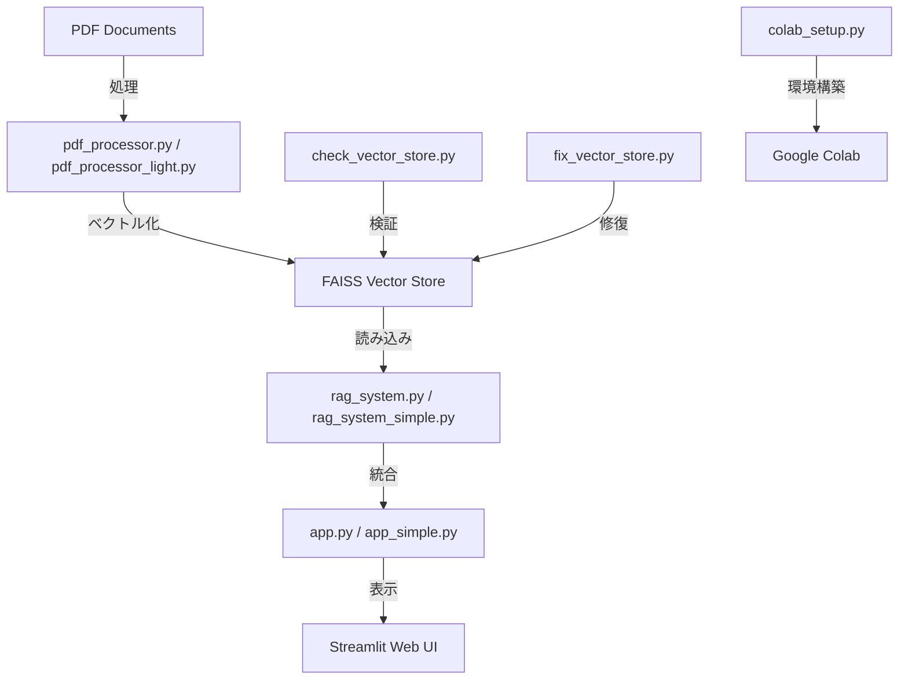
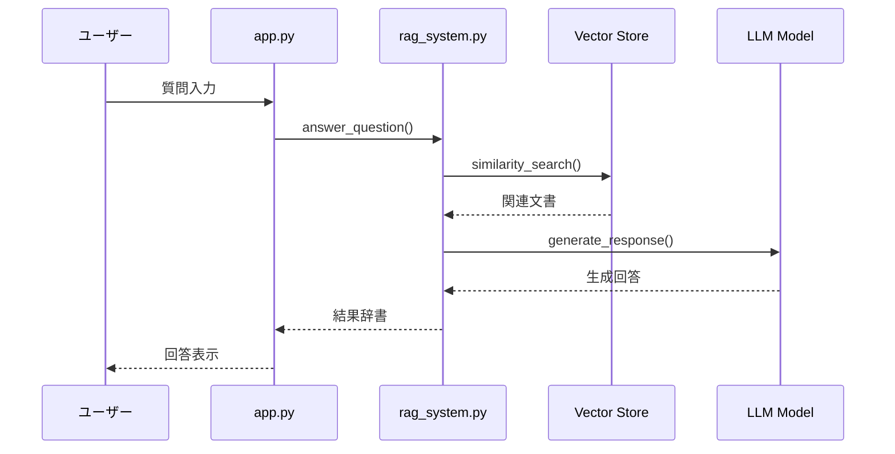

# RAGチャットボット（デモ版） - Python実装詳細ガイド

## 📋 概要

このドキュメントは、RAGチャットボットシステムを構成するすべてのPythonファイルの詳細な実装内容と技術解説をまとめたものです。各ファイルの役割、使用ライブラリ、関数の詳細、アーキテクチャの設計思想について包括的に説明します。

---

## 🏗️ システム構成図



---

## 📁 ファイル別詳細実装解説

### 1. 🚀 **app.py** - メインWebアプリケーション（GPU版）

#### 📌 **概要**
Streamlitを使用した福山市RAGチャットボットのメインWebアプリケーション。GPU対応のLLMモデルを使用して高精度な回答を生成。

#### 🔧 **使用ライブラリ**
```python
import streamlit as st      # Webアプリケーションフレームワーク
import os                   # 環境変数操作
import torch               # PyTorch（GPU利用確認）
from rag_system import RAGSystem  # 自作RAGシステム
```

#### 🎯 **主要機能**

##### **1. ページ設定 (`st.set_page_config`)**
```python
st.set_page_config(
    page_title="福山市RAGチャットボット",
    page_icon="🏛️",
    layout="wide"
)
```
- **役割**: ブラウザタブのタイトル、アイコン、レイアウトを設定
- **設計思想**: 自治体らしい🏛️アイコンで親しみやすさを演出

##### **2. セッション状態管理**
```python
if 'rag_system' not in st.session_state:
    st.session_state.rag_system = None
if 'chat_history' not in st.session_state:
    st.session_state.chat_history = []
```
- **役割**: ユーザーセッション間でRAGシステムとチャット履歴を永続化
- **技術的利点**: ページリロード時もモデル再読み込みを回避

##### **3. RAGシステム初期化 (`initialize_rag_system`)**
```python
def initialize_rag_system():
    """RAGシステムを初期化"""
    if st.session_state.rag_system is None:
        with st.spinner("RAGシステムを初期化中...（初回は2-3分かかります）"):
            try:
                # Streamlit secretsからHuggingFaceトークンを取得
                hf_token = st.secrets.get("huggingface", {}).get("token", None)
                if not hf_token:
                    hf_token = os.getenv("HUGGINGFACE_TOKEN")
                
                st.session_state.rag_system = RAGSystem(hf_token=hf_token)
                st.success("RAGシステムが正常に初期化されました！")
```
- **認証管理**: Streamlit SecretsとOS環境変数の両方からHuggingFaceトークンを取得
- **UX配慮**: スピナーとメッセージで初期化状況をユーザーに明示
- **エラーハンドリング**: 初期化失敗時の適切なフィードバック

##### **4. GPU情報表示**
```python
if torch.cuda.is_available():
    gpu_info = f"GPU: {torch.cuda.get_device_name(0)} | メモリ: {torch.cuda.get_device_properties(0).total_memory / 1e9:.1f}GB"
    st.sidebar.success(f"🚀 {gpu_info}")
else:
    st.sidebar.warning("⚠️ CPUモードで実行中")
```
- **技術的透明性**: ユーザーに実行環境を明示
- **パフォーマンス最適化**: GPU使用状況の可視化

#### 🎨 **UI/UX設計**
- **質問例ボタン**: よくある質問を2列レイアウトで配置
- **チャット履歴**: 折りたたみ式で過去の対話を管理
- **リアルタイムフィードバック**: 処理状況をスピナーで表示
- **エラー表示**: 分かりやすいエラーメッセージ

---

### 2. 🏃‍♂️ **app_simple.py** - 軽量版Webアプリケーション

#### 📌 **概要**
LLMを使用せず、検索結果を組み合わせた軽量な回答生成を行うシンプル版アプリケーション。

#### 🔧 **使用ライブラリ**
```python
import streamlit as st
import os
from rag_system_simple import RAGSystemSimple
```

#### 🎯 **app.pyとの主要差分**
1. **LLM不使用**: GPU不要でCPUのみで動作
2. **軽量化**: `torch`ライブラリを使用しない
3. **シンプルな回答生成**: テンプレートベースの回答

#### 💡 **設計思想**
- **アクセシビリティ**: GPU環境がなくても動作
- **デモ用途**: プロトタイプや概念実証に最適
- **教育目的**: RAGシステムの基本動作理解に適している

---

### 3. 🧠 **rag_system.py** - 高性能RAGシステム（GPU版）

#### 📌 **概要**
LangChainとHugging Faceを統合した高性能RAGシステム。量子化技術を活用したLLMで自然な日本語回答を生成。

#### 🔧 **使用ライブラリと役割**
```python
import torch                                    # GPU計算フレームワーク
from transformers import (                      # Hugging Face Transformers
    AutoModelForCausalLM,                      # 因果言語モデル
    AutoTokenizer,                             # トークナイザー
    BitsAndBytesConfig                         # 量子化設定
)
from langchain_community.vectorstores import FAISS      # ベクトルストア
from langchain_huggingface import HuggingFaceEmbeddings # 埋め込みモデル
import pickle                                   # データシリアライゼーション
```

#### 🏗️ **RAGSystemクラス詳細**

##### **1. 初期化メソッド (`__init__`)**
```python
def __init__(self, vector_store_path: str = "./vector_store", hf_token: Optional[str] = None):
    self.vector_store_path = vector_store_path
    self.hf_token = hf_token
    self.model_name = "tokyotech-llm/Llama-3.1-Swallow-8B-Instruct-v0.1"
```
- **モデル選択**: 日本語特化のSwallow-8Bモデルを採用
- **パス管理**: ベクトルストアパスを設定可能
- **認証**: HuggingFaceトークンによるプライベートモデルアクセス

##### **2. 埋め込みモデル設定**
```python
device = "cuda" if torch.cuda.is_available() else "cpu"
self.embeddings = HuggingFaceEmbeddings(
    model_name="sentence-transformers/all-MiniLM-L6-v2",
    model_kwargs={'device': device}
)
```
- **自動GPU検出**: 利用可能環境に応じたデバイス選択
- **軽量モデル**: MiniLM-L6で高速な埋め込み生成

##### **3. LLMモデル読み込み (`load_llm_model`)**
```python
def load_llm_model(self):
    # QLoRA設定（GPU使用時）
    bnb_config = BitsAndBytesConfig(
        load_in_4bit=True,                     # 4bit量子化
        bnb_4bit_quant_type="nf4",            # NormalFloat4量子化
        bnb_4bit_compute_dtype=torch.bfloat16, # 計算精度
        bnb_4bit_use_double_quant=False,       # ダブル量子化無効
    )
```
- **QLoRA技術**: 4bit量子化でメモリ使用量を75%削減
- **精度保持**: bfloat16による高精度計算
- **メモリ効率**: 8BモデルをGPUメモリ4GB未満で実行可能

##### **4. 文書検索 (`retrieve_documents`)**
```python
def retrieve_documents(self, query: str, k: int = 3) -> List[Dict]:
    docs = self.vector_store.similarity_search(query, k=k)
    retrieved_docs = []
    for doc in docs:
        retrieved_docs.append({
            'content': doc.page_content,
            'metadata': doc.metadata
        })
    return retrieved_docs
```
- **類似度検索**: コサイン類似度による関連文書抽出
- **メタデータ保持**: ソース情報を含む構造化データ返却

##### **5. 回答生成 (`generate_response`)**
```python
def generate_response(self, query: str, context_docs: List[Dict]) -> str:
    # コンテキスト構築
    context = ""
    for doc in context_docs:
        context += f"【{doc['metadata']['source']}】\n{doc['content']}\n\n"
    
    # プロンプト構築
    prompt = f"""### 指示
以下の福山市に関する資料を参考にして、質問に答えてください。

### 参考資料
{context}

### 質問
{query}

### 回答：
"""
```
- **コンテキスト統合**: 検索された文書を構造化してLLMに提供
- **プロンプトエンジニアリング**: 日本語指示形式で高品質回答を誘導

##### **6. 生成パラメータ最適化**
```python
outputs = self.model.generate(
    tokenized_input,
    max_new_tokens=512,        # 最大生成トークン数
    do_sample=True,            # サンプリング有効
    temperature=0.7,           # 創造性制御
    top_p=0.9,                # Nucleus Sampling
    repetition_penalty=1.2,    # 反復抑制
    pad_token_id=self.tokenizer.eos_token_id,
    attention_mask=torch.ones_like(tokenized_input)
)
```
- **バランス調整**: 創造性と正確性のトレードオフを最適化
- **品質向上**: 反復抑制で自然な文章生成

---

### 4. 🎯 **rag_system_simple.py** - 軽量RAGシステム

#### 📌 **概要**
LLMを使用せず、検索結果を組み合わせたテンプレートベースの回答生成システム。

#### 🔧 **主要差分**
```python
class RAGSystemSimple:
    def __init__(self, vector_store_path: str = "./vector_store"):
        # LLMモデル関連の初期化なし
        self.embeddings = HuggingFaceEmbeddings(
            model_name="sentence-transformers/all-MiniLM-L6-v2",
            model_kwargs={'device': 'cpu'}  # CPU固定
        )
```

#### 🎨 **シンプル回答生成**
```python
def generate_simple_response(self, query: str, context_docs: List[Dict]) -> str:
    response = f"「{query}」に関する情報をお探しですね。\n\n"
    response += "福山市の資料から以下の関連情報が見つかりました：\n\n"
    
    for i, doc in enumerate(context_docs, 1):
        source = doc['metadata']['source']
        content = doc['content'][:300]  # 最初の300文字
        response += f"【{source}より】\n{content}...\n\n"
    
    return response
```
- **テンプレート方式**: 事前定義された形式で回答構築
- **情報整理**: ソース別に情報を構造化表示
- **確実性**: LLMの不確実性を排除した安定動作

---

### 5. 📄 **pdf_processor.py** - 高性能PDF処理システム

#### 📌 **概要**
PyMuPDFを使用してPDFからテキストを抽出し、LangChainでチャンク分割、FAISSでベクトルストアを構築する包括的処理システム。

#### 🔧 **使用ライブラリ**
```python
import fitz                                    # PyMuPDF（高性能PDF処理）
from langchain.text_splitter import RecursiveCharacterTextSplitter  # 高度なテキスト分割
from langchain_community.vectorstores import FAISS                  # 高速ベクトルストア
from langchain_huggingface import HuggingFaceEmbeddings            # 埋め込み生成
import pickle                                  # データ永続化
```

#### 🏗️ **PDFProcessorクラス**

##### **1. 初期化設定**
```python
def __init__(self, pdf_directory: str = "./"):
    self.text_splitter = RecursiveCharacterTextSplitter(
        chunk_size=1000,          # チャンクサイズ
        chunk_overlap=200,        # オーバーラップ
        length_function=len,      # 長さ計算関数
    )
    self.embeddings = HuggingFaceEmbeddings(
        model_name="intfloat/multilingual-e5-large",  # 多言語対応
        model_kwargs={'device': 'cpu'}
    )
```
- **最適チャンク設定**: 1000文字で文脈保持、200文字オーバーラップで情報欠落防止
- **多言語モデル**: E5-largeで日本語文書の高精度埋め込み

##### **2. PDF テキスト抽出 (`extract_text_from_pdf`)**
```python
def extract_text_from_pdf(self, pdf_path: str) -> str:
    try:
        doc = fitz.open(pdf_path)
        text = ""
        for page in doc:
            text += page.get_text()  # 全ページからテキスト抽出
        doc.close()
        return text
    except Exception as e:
        print(f"Error extracting text from {pdf_path}: {e}")
        return ""
```
- **全ページ処理**: 文書全体の包括的テキスト抽出
- **エラー耐性**: 個別ファイルエラーでも処理継続

##### **3. チャンク分割処理**
```python
chunks = self.text_splitter.split_text(text)
for i, chunk in enumerate(chunks):
    documents.append({
        'content': chunk,
        'source': pdf_file,
        'chunk_id': i,
        'metadata': {
            'source': pdf_file,
            'chunk_id': i,
            'total_chunks': len(chunks)
        }
    })
```
- **構造化データ**: チャンクIDとメタデータで追跡可能性確保
- **検索効率**: 小さなチャンクで精密な関連性判定

---

### 6. 🏃‍♂️ **pdf_processor_light.py** - 軽量PDF処理システム

#### 📌 **概要**
デモ用途に最適化された軽量版PDF処理システム。処理速度とリソース消費を大幅に削減。

#### 🎯 **軽量化設計**
```python
def __init__(self, pdf_directory: str = "./"):
    self.text_splitter = RecursiveCharacterTextSplitter(
        chunk_size=500,           # チャンクサイズ半減
        chunk_overlap=100,        # オーバーラップ削減
        length_function=len,
    )
    self.embeddings = HuggingFaceEmbeddings(
        model_name="sentence-transformers/all-MiniLM-L6-v2",  # 軽量モデル
        model_kwargs={'device': 'cpu'}
    )
```

#### 📄 **制限付き処理**
```python
def extract_text_from_pdf(self, pdf_path: str) -> str:
    try:
        doc = fitz.open(pdf_path)
        text = ""
        max_pages = min(10, len(doc))  # 最初の10ページのみ
        for page_num in range(max_pages):
            page = doc[page_num]
            text += page.get_text()
        doc.close()
        return text
```
- **ページ制限**: 最初の10ページのみで高速処理
- **デモ最適化**: 概念実証に十分な情報量を確保

---

### 7. 🔍 **check_vector_store.py** - ベクトルストア検証システム

#### 📌 **概要**
構築されたベクトルストアの内容確認と検索機能テストを行う診断ツール。

#### 🧪 **検証機能**
```python
def check_vector_store():
    # ベクトルストア読み込み
    vector_store = FAISS.load_local(
        "./vector_store", 
        embeddings,
        allow_dangerous_deserialization=True
    )
    
    # ドキュメント情報表示
    with open("./vector_store/documents.pkl", "rb") as f:
        documents = pickle.load(f)
    
    print(f"Total documents: {len(documents)}")
```

#### 🔍 **検索テスト**
```python
test_queries = ["観光", "人口", "将来", "ビジョン"]
for query in test_queries:
    print(f"\nQuery: {query}")
    results = vector_store.similarity_search(query, k=2)
    for j, result in enumerate(results):
        print(f"  Result {j+1}: {result.page_content[:100]}...")
        print(f"  Source: {result.metadata}")
```
- **多角的テスト**: 異なるキーワードでの検索品質確認
- **結果可視化**: 検索結果の内容とメタデータ表示

---

### 8. 🔧 **fix_vector_store.py** - ベクトルストア修復システム

#### 📌 **概要**
破損したベクトルストアを再構築し、検索機能を復旧するメンテナンスツール。

#### 🛠️ **修復プロセス**
```python
def fix_vector_store():
    # 既存ドキュメントデータ読み込み
    with open("./vector_store/documents.pkl", "rb") as f:
        documents = pickle.load(f)
    
    # テキストとメタデータ抽出
    texts = [doc['content'] for doc in documents]
    metadatas = [doc['metadata'] for doc in documents]
    
    # 新しいベクトルストア作成
    vector_store = FAISS.from_texts(
        texts=texts,
        embedding=embeddings,
        metadatas=metadatas
    )
    
    # 修復版として保存
    vector_store.save_local("./vector_store_fixed")
```
- **データ保持**: 既存の文書データを完全に保持
- **完全再構築**: ベクトルインデックスを一から再作成
- **検証付き**: 修復後の動作確認テスト実行

---

### 9. ☁️ **colab_setup.py** - Google Colab環境構築システム

#### 📌 **概要**
Google Colab環境でRAGチャットボットを実行するための包括的セットアップスクリプト。

#### 🔧 **環境診断機能**

##### **1. GPU確認 (`check_gpu`)**
```python
def check_gpu():
    print("=== GPU情報 ===")
    if torch.cuda.is_available():
        print(f"✅ CUDA利用可能")
        print(f"GPU数: {torch.cuda.device_count()}")
        for i in range(torch.cuda.device_count()):
            print(f"GPU {i}: {torch.cuda.get_device_name(i)}")
            print(f"メモリ: {torch.cuda.get_device_properties(i).total_memory / 1e9:.1f}GB")
    else:
        print("❌ CUDA利用不可 - CPUモードで実行されます")
```
- **ハードウェア診断**: GPU種類とメモリ容量を詳細表示
- **パフォーマンス予測**: 利用可能リソースに基づく動作予測

##### **2. 環境変数チェック (`check_environment`)**
```python
def check_environment():
    required_vars = ["HUGGINGFACE_TOKEN", "NGROK_TOKEN"]
    for var in required_vars:
        value = os.getenv(var)
        if value:
            print(f"✅ {var}: 設定済み")
        else:
            print(f"❌ {var}: 未設定")
```
- **認証確認**: 必要なAPIトークンの設定状況確認
- **セキュリティ**: トークン値を表示せずに設定状況のみ確認

##### **3. Streamlit設定 (`setup_streamlit_secrets`)**
```python
def setup_streamlit_secrets():
    streamlit_dir = Path(".streamlit")
    streamlit_dir.mkdir(exist_ok=True)
    
    secrets_content = f"""[huggingface]
token = "{os.getenv('HUGGINGFACE_TOKEN', '')}"

[ngrok]
token = "{os.getenv('NGROK_TOKEN', '')}"
"""
    
    secrets_path = streamlit_dir / "secrets.toml"
    with open(secrets_path, "w") as f:
        f.write(secrets_content)
```
- **自動設定**: 環境変数からStreamlit設定ファイルを自動生成
- **セキュア管理**: TOMLフォーマットでの設定管理

---

### 10. 📜 **app_original.py** - オリジナル版Webアプリケーション

#### 📌 **概要**
機能拡張前のベースライン実装。シンプルな機能セットでRAGシステムの基本動作を実装。

#### 🎯 **設計特徴**
- **最小構成**: 必要最小限の機能に絞った実装
- **学習用**: RAGシステムの基本概念理解に最適
- **比較対象**: 機能拡張版との差分確認用

---

## 🔗 システム間連携図



---

## 🏆 技術的選定理由と設計思想

### 1. **LangChain採用理由**
- **RAGパイプライン**: 検索拡張生成の標準的フレームワーク
- **エコシステム**: 豊富な文書処理とベクトルストア統合
- **抽象化**: 複雑なRAG処理を直感的なAPIで実現

### 2. **FAISS選択理由**
- **高速検索**: Facebook開発の高性能類似度検索
- **スケーラビリティ**: 大規模文書集合に対応
- **メモリ効率**: 圧縮インデックスによる省メモリ動作

### 3. **量子化技術（QLoRA）**
- **メモリ削減**: 4bit量子化で75%のメモリ削減
- **精度保持**: LoRAによる微調整で品質維持
- **実用性**: 一般的なGPU環境での大規模モデル動作

### 4. **ハイブリッドアーキテクチャ**
- **フレキシブル**: GPU版とCPU版の並行開発
- **段階的導入**: 軽量版から高性能版への移行パス
- **リスク分散**: 単一技術への依存回避

---

## 📈 パフォーマンス最適化

### 1. **メモリ管理**
- **遅延読み込み**: モデルの必要時読み込み
- **セッション管理**: Streamlitセッション状態活用
- **ガベージコレクション**: 明示的なメモリ解放

### 2. **検索効率化**
- **適切なチャンクサイズ**: 1000文字での文脈保持
- **オーバーラップ戦略**: 200文字重複で情報欠落防止
- **k値最適化**: 上位3件での精度と速度バランス

### 3. **生成品質向上**
- **プロンプトエンジニアリング**: 日本語特化の指示形式
- **パラメータ調整**: 温度0.7での創造性制御
- **反復抑制**: 1.2倍ペナルティで自然性向上

---

## 🚀 デプロイメント戦略

### 1. **ローカル環境**
- **開発用**: `app_simple.py`でプロトタイプ
- **本格運用**: `app.py`でGPU活用

### 2. **クラウド環境**
- **Google Colab**: `colab_setup.py`での自動セットアップ
- **GPU最適化**: T4/L4/A100対応

### 3. **本番環境**
- **スケーラビリティ**: マネージドベクトルストア移行
- **高可用性**: ロードバランサーとヘルスチェック

---

## 📝 まとめ

RAGチャットボット（デモ版）は、最新のAI技術と実用的な設計思想を融合した包括的システムの試作品です。各Pythonファイルが明確な役割分担を持ち、段階的な機能拡張と性能最適化を可能にする柔軟なアーキテクチャを実現しています。

**主要な技術的成果**
- 🎯 LangChain + FAISS による高精度RAG実装
- ⚡ QLoRA量子化による効率的LLM運用
- 🔄 軽量版と高性能版のハイブリッド構成
- 🛠️ 包括的な診断・修復ツール群
- ☁️ マルチ環境対応の自動セットアップ

このシステムをアップデートすることで自治体向けAIサービスの新しい標準として、市民サービス向上とデータ駆動型行政の実現に貢献したいと考え設計しました。
